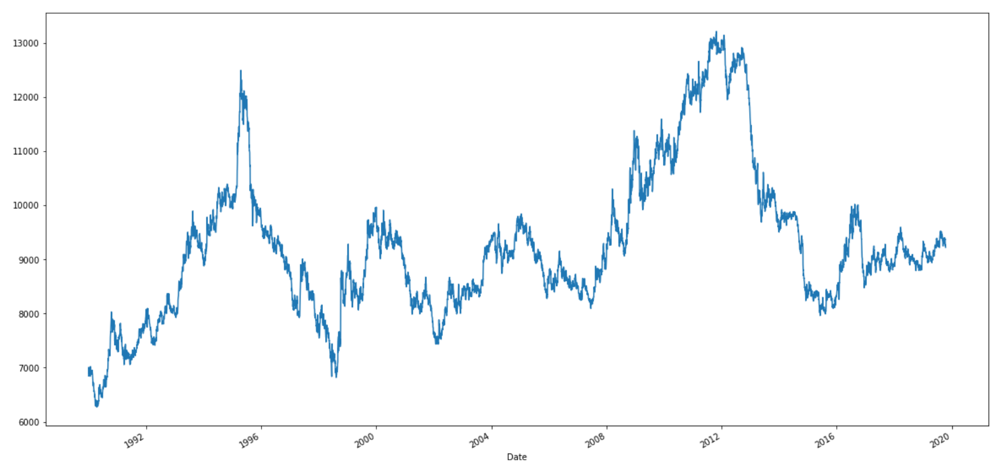
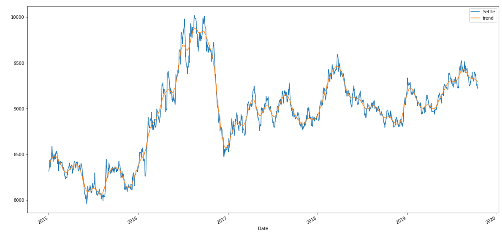
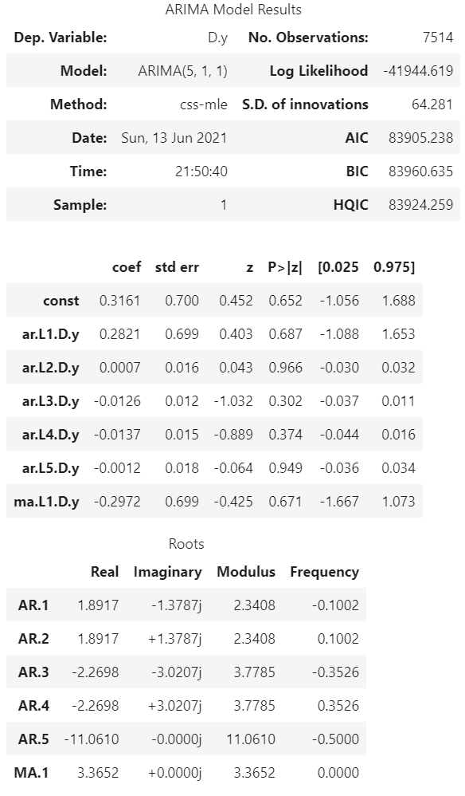
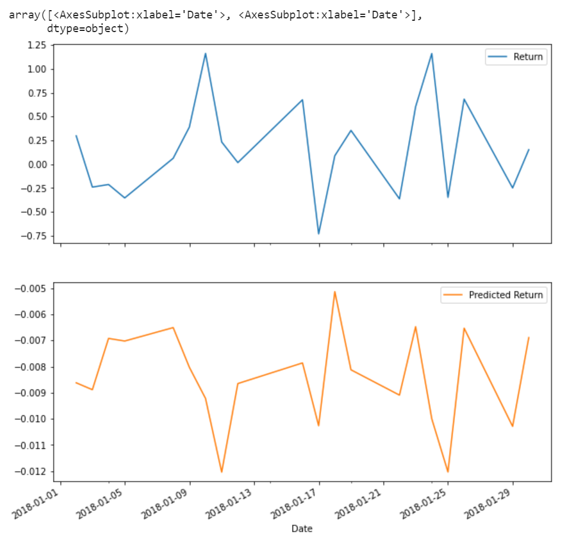

# Unit10_TimeSeries_Regression - Yen Futures

## Time Series Analysis

Yen futures time series plota showing a long term pattern in a gradual upward trend, short term volatility with no clear trend

Hodrick-Prescott Filter showing Settle price and trend (and noise on seperate chart)

Assessment of results through ARMA

Based on the p-values the model is not a good fit as the P value is greater than 0.05 (95% confidence interval) for the constant and all lags

ARIMA models

Based on the p-values this model is generally not a good fit however there is confidence at the 95% level projecting from the 2 day lag (0.966). The 5 day lag is very close to reaching confidence (0.949)

The Japanese Yen is forecast to rise in the next 5 days according to the models however the models are not fully reliable

GARCH model

Based on the p-values the model is not a good fit as the 95% confidence interval is > 0.05

## Regression Analysis

SKLearn Linear Regression

Lagged returns split out from data and data cleaned

Training and Test data split

Training and test data still have high volatility and error rate seen through return and predicted return

In-Sample RMSE of 0.59 is higher than Out-of-Sample RMSE 0.41 indicating that the test data has less error and is performing better than the training data
